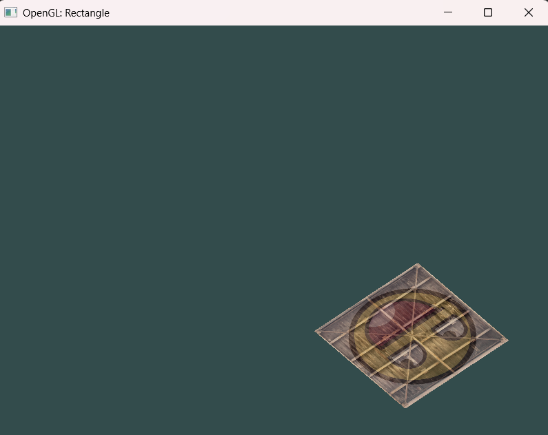

## 🌱 Description
The program is a demonstration of how to **render Textured Rectangle and apply transformations (V1)** using OpenGL. First Scale then rotate then translate. GLFW library is used for the window management and OpenGL context management. To generate binary .exe file, follow [below steps](#how-to-run). Once .exe file is  executed, a new window will appear with an output rendered on it.

## 🗣️ Dependencies
This project has dependencies on following libraries:
1. **Windows SDK**  
This contains a standard Windows system libraries such as **user32.lib, gdi32.lib, kernel32.lib, shell32.lib, opengl32.lib**.
2. **Visual Studio Toolset for C++ Development**  
This is required to compile (cl.exe), link (link.exe) and create a binary (.exe) from source code.
1. **glad**  
On Windows, you might use opengl32.lib, which is the import library file for opengl32.dll which comes with every windows version since Windows 95. However, this DLL does not contain the OpenGL implementation you are typically using, but it contains Microsoft's OpenGL 1.1 GDI software rasterizer. The actual OpenGL implementation on windows is provided by an Installable Client Driver (ICD) which comes with your graphics driver. For OpenGL 1.0 and 1.1 functions, opengl32.dll will act as a trampoline and will forward the calls to the actual ICD DLL. If you want to call any OpenGL function beyond OpenGL 1.1 (and that one is from 1997), you have to use the OpenGL extension mechanism in every case, as opengl32.dll does not provide these entry points at all, and the compiler/linker will of course not find them. GLAD loads OpenGL function pointers (And can generate a file online with specific GL settings).  
2. **GLFW**   
for OpenGL context and window management
3. **KHR**    
To keep things simpler Khronos maintains the khrplatform header to be used by other headers maintained by Khronos, defining common data types, tokens and calling convention macros. 
4. **stb_image.h**  
For Image loading  
5. **GLM**  
Used for mathematical calculations

## How To Run
1. Open Visual Studio **Developer Command Prompt**
2. **Compile:** 
```
# Execute below command to compile the code:  
cl.exe /MD /c /EHsc /I ../../../../include Window.cpp glad.c

# Command Explaination:
# cl.exe - compiler for C and C++
# /MD - Use the multithread-specific and DLL-specific version of the runtime library. Defines _MT and _DLL. The linker uses the MSVCRT.lib import library to resolve runtime symbols.
# /c - Compile Without Linking
# /EHsc - instructs the compiler to enable standard C++ exception handling behavior
# /I - specifies an additional directory to search for include files
# include folder contains header files for below libraries: glad, GLFW, KHR  
```
This will create **Window.obj** and **glad.obj** files in your current directory.    

3. **Link:**
```
# Execute below command to link object files and libraries and generate the executable:  
link.exe Window.obj glad.obj /LIBPATH:..\..\..\..\lib GLFW/glfw3.lib user32.lib gdi32.lib kernel32.lib shell32.lib opengl32.lib /NODEFAULTLIB:msvcrtd.lib

# Command Explaination:
# link.exe - the linker, a tool that combines compiled object files and libraries into a single executable file or a dynamic-link library (DLL)
# /LIBPATH - to override the environment library path. The linker first searches in the path specified by this option, and then searches in the path specified in the LIB environment variable.
# lib folder contains .lib files for below libraries:
GLFW
# user32.lib, gdi32.lib, kernel32.lib, shell32.lib, opengl32.lib - a standard Windows system libraries are typically found within the Windows SDK installation directory.
# /NODEFAULTLIB tells the linker to ignore the #pragma comment directive that was generated from the /MT compiled code
```  
### OR  
You can also execute below single command which compiles and links in one go  
```
cl.exe /MD /EHsc -I ../../../../include Window.cpp glad.c /link /LIBPATH:"..\..\..\..\lib" GLFW/glfw3.lib user32.lib gdi32.lib shell32.lib opengl32.lib /NODEFAULTLIB:msvcrtd.lib
```

This will create **Window.exe** file in your current directory.    

4. **Run:** Double Click(Execute) Window.exe to see the output  

5. **Output:**  
Output of the run is as follows.

---

## 🌟 Developer/Contributor
Name: Rohit Shamrao Muneshwar  
Email: rohit.muneshwar1406@gmail.com  
LinkedIn Profile: [Click Here](https://www.linkedin.com/in/rohit-muneshwar-a9079258/)  
Other Github repositories: [Click Here](https://github.com/rohit1406?tab=repositories)  

---