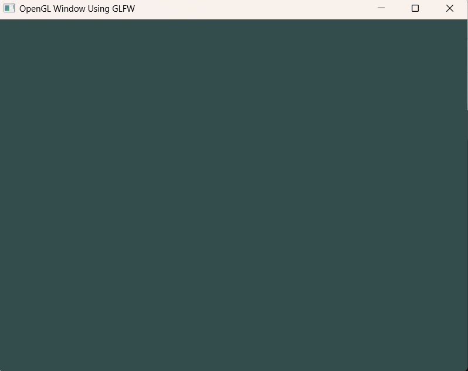

### 🌱 Description:
The program is a demonstration of how to create a simple plain window using GLFW which we will use later for rendering OpenGL context.

### 🚀 How To Run:
1. Open Visual Studio **Developer Command Prompt**
2. **Compile:** 
```
cl.exe /MD /c /EHsc /I ../../../../include Window.cpp glad.c

# cl.exe - compiler for C and C++

# /MD - Use the multithread-specific and DLL-specific version of the runtime library. Defines _MT and _DLL. The linker uses the MSVCRT.lib import library to resolve runtime symbols.

# /c - Compile Without Linking

# /EHsc - instructs the compiler to enable standard C++ exception handling behavior

# /I - specifies an additional directory to search for include files

# include folder contains header files for below libraries: 
glad, GLFW, KHR  
```
This will create **Window.obj** and **glad.obj** files in your current directory.    

3. **Link:**
```
link.exe Window.obj glad.obj /LIBPATH:..\..\..\..\lib GLFW/glfw3.lib user32.lib gdi32.lib kernel32.lib shell32.lib opengl32.lib /NODEFAULTLIB:msvcrtd.lib

# link.exe - the linker, a tool that combines compiled object files and libraries into a single executable file or a dynamic-link library (DLL)

# /LIBPATH - to override the environment library path. The linker first searches in the path specified by this option, and then searches in the path specified in the LIB environment variable.

# lib folder contains .lib files for below libraries:
GLFW

# user32.lib, gdi32.lib, kernel32.lib, shell32.lib, opengl32.lib - a standard Windows system libraries are typically found within the Windows SDK installation directory.

# /NODEFAULTLIB tells the linker to ignore the #pragma comment directive that was generated from the /MT compiled code
```  
This will create **Window.exe** file in your current directory.    

4. **Run:** Window.exe  
You will see a new Window is popped up with Title "OpenGL Window Using GLFW"

5. **Output:**  
Output of the run is as follows.

---
